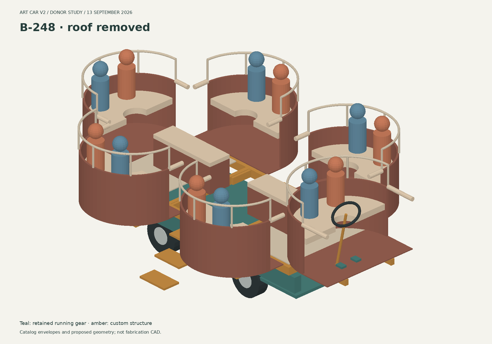

# Art car v2

Custom electric chassis (max 54" x 120") with a demountable body: six cantilevered two-seat pods under a cloverleaf roof.

**Start at [`index.html`](index.html)** — the plan of record: goal and constraints, the reference rendering, and one page per system. Open it in a browser; everything is static and works offline.

**B-248 donor study (13 September):** an additive concept study, not the plan of record — [retained donor body](model/b248-3d.html?layout=stock) · [running-gear transplant](model/b248-3d.html?layout=transplant) · [mechanical capacity and upgrade review](model/b248-review.md) · [dimensioned plan](model/b248/plan.svg). Compares a retained Taylor-Dunn B-248 donor body with a proposed 120 × 52 in frame reusing the donor's axles on a 72 in wheelbase. Six pods at 300 lb per occupied pod exceed the listing's 2,450 lb capacity at full occupancy under both scenarios modeled; the factory rating does not transfer to a custom frame. See [How we got here](explorations.html) for how it compares with the plan of record.

If the B-248 3D view cannot render, it falls back to the dimensioned plan with working load controls. After a viewer update, reload the page to pick up the fix. Developer smoke checks: `node model/b248/verify-viewer.cjs` (stub renderer; does not verify WebGL pixels).

## How the repo is organised

| What | Where |
|---|---|
| Plan of record (home) | [`index.html`](index.html) |
| System pages | [`plan/drivetrain.html`](plan/drivetrain.html) · [`plan/pods.html`](plan/pods.html) · [`plan/roof.html`](plan/roof.html) · [`plan/electrical.html`](plan/electrical.html) · [`plan/specification.html`](plan/specification.html) · [`plan/bom.html`](plan/bom.html) · [`plan/construction.html`](plan/construction.html) |
| How we got here (explorations, alternatives, decision log) | [`explorations.html`](explorations.html) |
| Alternative: B-248 donor chassis study | [`model/b248-3d.html`](model/b248-3d.html), [`model/b248-review.md`](model/b248-review.md) |
| Interactive models | [`model/`](model/) — each opens in a **simple** mode (the controls a designer would move) and switches to **advanced** (every parameter and the full readout) with the toggle at the top of the panel or `#advanced` on the URL |
| Working notes (the record) | [`notebook/art-car-design-notebook.html`](notebook/art-car-design-notebook.html), [`loveseat.md`](loveseat.md), [`model/drivetrain-review.md`](model/drivetrain-review.md), [`model/drivetrain-review-response.md`](model/drivetrain-review-response.md) |
| Sketches and renderings | [`sketches/`](sketches/) (originals) · [`img/`](img/) (web-sized copies and model screenshots used by the pages) |
| Shared stylesheet for the pages | [`site.css`](site.css) |

Editing conventions: the plan pages are plain HTML with one shared stylesheet — change the words in the page, change the look in `site.css`. Each system page has the same sections (what has been decided, key numbers, models, open items, how we got here) so a change to one system is one file. When the plan changes, update the system page and add a row to the decision log on `explorations.html`; do not delete the old exploration, link to it.

## Models

- [`model/frame-3d.html`](model/frame-3d.html) — interactive 3D model of the whole car (U or D pods, the driver pod with its gate, stair modules in the walkway slots, and a Trailer view with pods, stairs and roof stacked on the bare car inside the trailer, with a fit readout): ladder frame with receiver sleeves, QS205 car hub-motor corners on wide-pivot trailing arms (inclined kingpins at the front, A-arm legs inboard of the tire sweep, rack at the ball-joint station with fixed-length tie rods, column to the driver pod with a disconnect at the pod joint), air springs, dampers and bump stops, the six pods with riders, battery sled, and the roof — rectangle on four posts and a mast, petals on a mast, or the cloverleaf: six leaves as two halves, each on four posts at the leaf valleys, a lit rim fascia, two 100 W flex panels per leaf, plus the ottoman benches in the aisle. Sliders for the frame, deck material, wheels, arms, kneel, steering (rack travel, kingpin inclination, Ackermann arm angle), roof and corner loads. The readout solves the wheel angles, lock and its limiting part, Ackermann error, toe change over travel, every kneel stop and the bag's stroke and force, weighs the car from the drawn members plus a parts list, gives corner reactions for five loading cases and a static roll threshold, and flags the BRC guard height, ramp and tow limits. `window.frameModel` exposes the parameters for scripted checks.
- [`model/loveseat-build.html`](model/loveseat-build.html) — build model of one pod: every tube member and panel (1" square steel frame on the receiver arms, ply shell, lit diffuser wall with a fabric band, LED rows, mirror skirt, optional boarding step). Faceted or smooth wall; sliders for tube size, facets, band height, ply; readout of weight, cost, ply/diffuser sheets, LED count and receiver-arm stress. "Driver pod" toggle turns it into the driver module (legs forward with a floor, one pedal, gate, column and wheel, F/N/R and hand brake on the console). "Cut list" prints tube lengths, post coordinates and panel sizes; "Copy OBJ" exports the mesh (inches, Y up) for Blender/Fusion.
- [`model/loveseat-3d.html`](model/loveseat-3d.html) — interactive 3D model of one pod on its receivers with two seated riders; sliders for seat, rim, foam, pod radius.
- [`model/drivetrain-3d.html`](model/drivetrain-3d.html) — offline interactive component model of the drivetrain, fixed-length steering linkage, suspension motion, exploded front corner and Blender-compatible OBJ export. Candidate geometry; unresolved interfaces and detected clashes are called out. See [`model/drivetrain/README.md`](model/drivetrain/README.md) for saved diagrams, exports and the verification script.
- [`model/podcar_model.py`](model/podcar_model.py) — generates the 1:12 laser sheets from the `REAL` dict (real-world inches). `python3 podcar_model.py` writes `podcar_sheet_N.svg` (12 x 20 in) and `podcar_all.svg` (everything, stacked). No dependencies.
  - blue = score, red = inner cuts (holes/slots), magenta = part outlines; order the Glowforge steps score -> red -> magenta.
  - Material: 1/16" cardboard. Toothpicks for wheel axles and pod pins.
- [`model/b248-3d.html`](model/b248-3d.html) — donor-study model: retained-body (`?layout=stock`) and running-gear-transplant (`?layout=transplant`) layouts for a Taylor-Dunn B-248 donor cart. Additive concept study, not the plan of record; see [`model/b248-review.md`](model/b248-review.md).

## Working notes

- [`notebook/art-car-design-notebook.html`](notebook/art-car-design-notebook.html) — constraints (tow limit, BRC rules), chassis and corner-module concept, low-speed torque scenarios, battery decision and energy budget, core shapes, volumetric study of Selina's nine concepts, transport plan, open questions. Self-contained; sketch dimensions are editable in the `DESIGNS` array. Revised 2026-09-13 after the drivetrain review.
- [`loveseat.md`](loveseat.md) — pod mounting (hitch receivers), load case (corrected for the rail inset), seat ergonomics, fit, structure, weight, U outline, driver pod and kneel notes.
- [`model/drivetrain-review.md`](model/drivetrain-review.md) (2026-09-12) — errors, component sources, and the buy/fabricate/machine breakdown. [`model/drivetrain-review-response.md`](model/drivetrain-review-response.md) (2026-09-13) — what changed for each of the 13 findings, the four geometry changes they forced (steering layout, kingpin, kneel, pod receivers), and what is still open.
- [`model/b248-review.md`](model/b248-review.md) (2026-09-13) — B-248 mechanical capacity and upgrade review: factory parts evidence, payload discrepancy, and which upgrades are straightforward.
- [`sketches/`](sketches/) — Selina's renderings and layout sketches, plus photos of the current car.

## Key numbers
- Trailer: U-Haul 6x12 ramp, 143" x 72" deck, 57" ramp, 3,710 lb load / 1,810 lb ramp.
- Chassis: <= 54" x 120", four QS205 car hub motors (12 x 8.5 rims, Carlstar 23x10.50-12 turf tires, 22.5" mounted) on trailing arms with D2500 air springs and dampers, 48 V, 28.7 kWh nominal (23-26 usable) LFP sled 50 x 21 x 10.5" that rolls under and bolts up. Car as drawn ~2,740 lb; ~5,140 with 12 aboard; heaviest corner ~1,830 lb (12 seated + 4 crowded at the rear).
- Wheels under the side pods (axles at +-33", track 43", wheelbase 66"); each side pod's receivers 28" apart straddle the tire. With wheel wells and a 6" fender box in the pod foot space the car kneels ~5.6" (pod floors 24" -> ~18.4"): the D2500 bottoms at 6.0" through the 0.625 motion ratio and the tire chord meets the sleeves at 5.6" as the axle walks toward its pivot.
- Side rails sit 14" in from the envelope edge (24" apart, 2x4 tube), 3.4" inboard of the tire's inner face so the tire chord at rail height clears the rail at full lock. Receiver sleeves (2.5 x 3.5) pass through the rails at deck level.
- Steering: kingpins 8" inboard of the hub centre (about the least a single-sided hub motor allows), inclined 12" for ~5.6" of scrub at the ground; rack at the ball-joint station, ~22" inner lock, ~15.5 ft to the outside tire, toe change 1.4" over +-3" of travel. Service brake: pedal, tandem master, four calipers; parking brake: hand lever to two rear mechanical calipers.
- BRC: 5 mph day and night. The 36-48" perimeter guardrail rule applies to levels 84" or more above the playa (MV Owner's Handbook), so at a 24" floor the 26" pod rim and 12" driver gate are design choices; the stair module needs a secure railing. Tow target 5,000 lb (used Cruise America RV): trailer 2,290 + car ~2,740 = ~5,030 before cargo, so the battery sled and loose modules ride in the RV.
- Pods: r = 24", side pods at (+-33, +-27), end pods tangent at -73 / +75 (rear rim -97", driver gate +91", overall ~188" x 102"); front pod faces forward (driver).
- Roof (cloverleaf, current direction): leaves r = 32" centred at (±24, ±21) and over the end pods, top of rim 102" (underside 99", so a 6'2" rider can stand on the deck), rim 3" deep and lit (~47 ft, ~1,700 LEDs in two rows), 8 posts at (±10, ±13) and (±50, ±13), 12 × 41×21" flex panels (~1.2 kW nominal, ~54 lb), ~155 lb of aluminium tube; six leaf pieces ≤ 64" square for the trailer.
- Pods are U-shaped in plan (180° arc + 12" legs over the deck, 48" x 36"); side pods at +-33 leave an 18" walkway slot for a stair module; U pods stack 4 per layer on the trailer (exactly two across at 36"), D pods 2. Receiver arms 2x3x0.188" on edge, 13" engaged: ~14 ksi at the x3 design moment measured from the rail face (~12,500 in-lb static per passenger pod).
